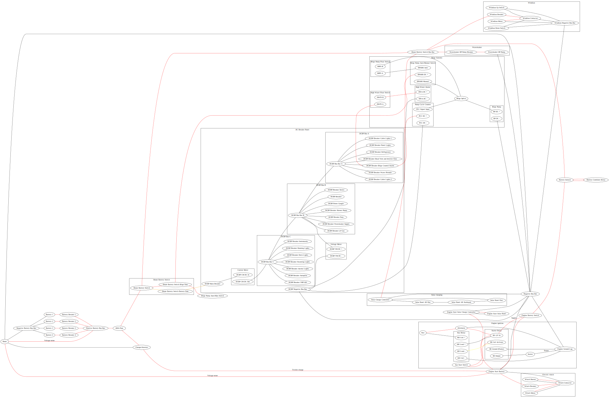
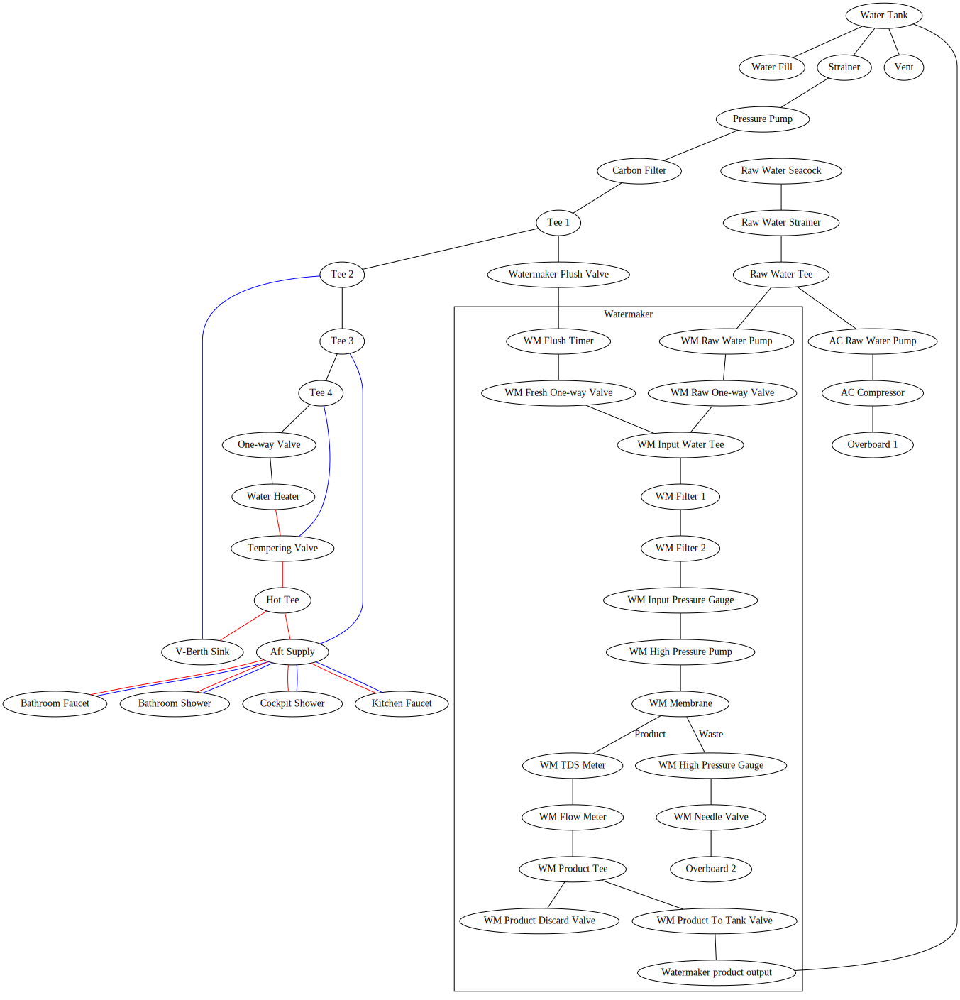
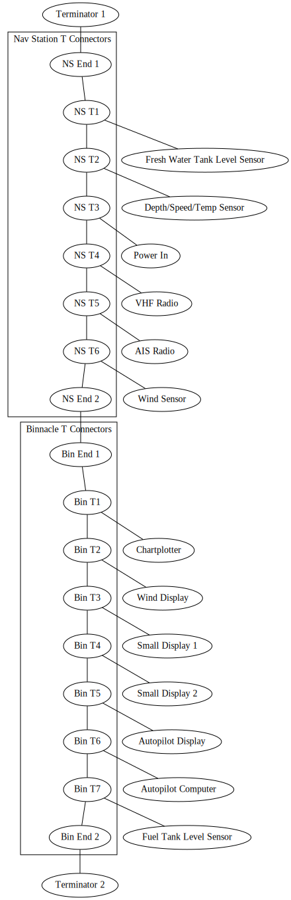

# Hunter 376 "Prairie Tumbleweed" documentation #

A collection of many things about our boat.

## Logs ##
[2020 log](log-2020.md)

[2019 log](log-2019.md)

I keep a log of all of our travels, including engine hours, sailing hours, and miles travelled.  They are simple tables in a Markdown file for each year.

## Systems diagrams ##
I have created diagrams of the electrical and plumbing systems.  They are pretty complex so it helps to have these for troubleshooting some issues.  After 20+ years the systems are substantially different from when they were documented by the factory.

I used the [GraphViz](https://graphviz.gitlab.io/) dot system to create these in a way that is simple to store and version (plain text) and sort of simple to maintain.  The electical file is probably at the limit of reasonable size!  Having some background in coding is probably necessary to doing things this way.

The code links take you to the code files.  The inline images are SVG that I manually export occasionally using the Graphviz Preview extension in Visual Studio Code.  So they may not necessarily be updated for minor changes.

### Electrical ###
[Code](electrical.gv) | Incomplete areas: AC wiring, most of the alternator/engine wiring

### Plumbing ###
[Code](plumbing.gv)

### NMEA 2000 ###
[Code](nmea-2000.gv) | The T connectors are not necessarily ordered in the same way that they physically are connected on the boat.

